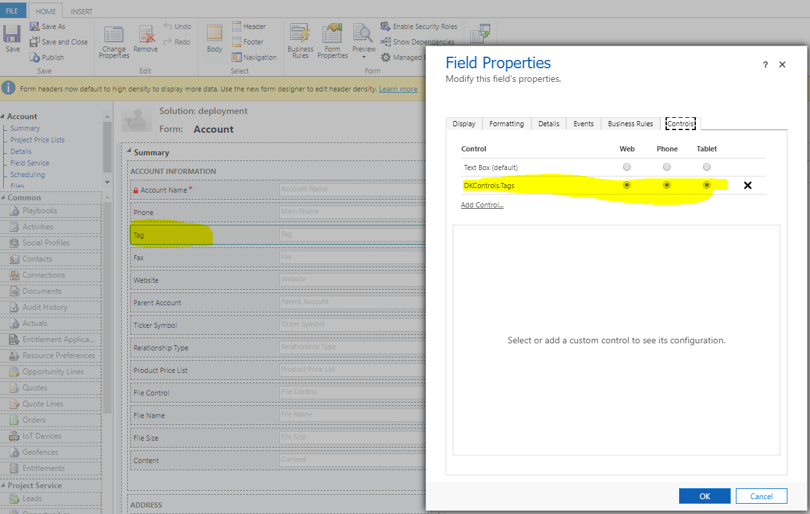
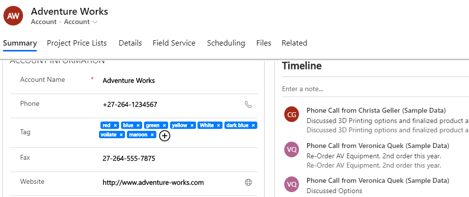

# Multiple Tag PCF Control 
Converts single of text or text area fields to Tag control. You can add or remove the tags.
Download the solution and import into your Dynamics CRM environment.

[Unmanaged solution 1.0.0.0](https://github.com/durgaprasadkatari/TagControl.PCF/raw/master/Solution/TagControlPCF_1_0_0_0.zip)

[Managed solution 1.0.0.0](https://github.com/durgaprasadkatari/TagControl.PCF/raw/master/Solution/TagControlPCF_1_0_0_0_managed.zip)

1. Click on change properties of the Single Line of Text field, navigate to Controls tab and then add the TagControl as shown in the below image.

2. It will convert your text field into beautiful multiple tags control.

